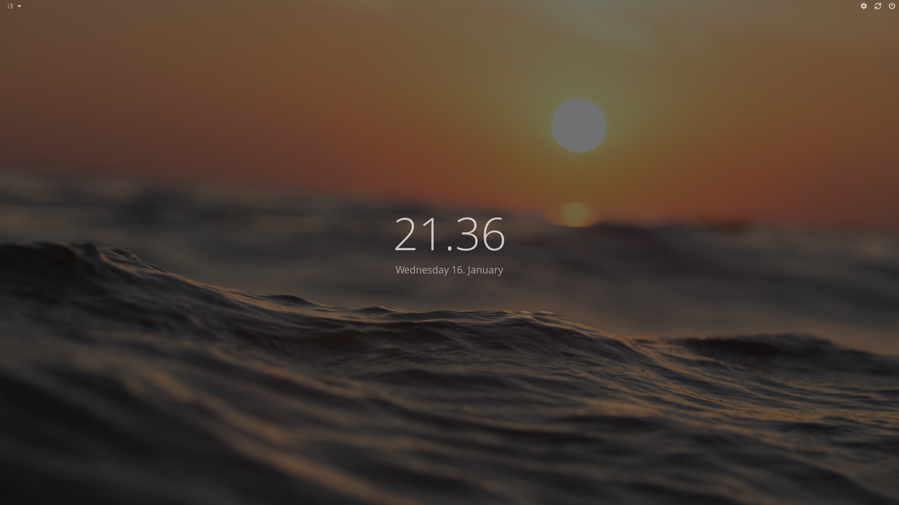
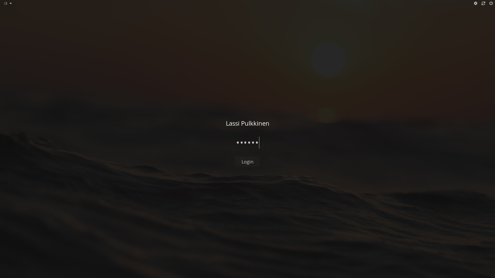
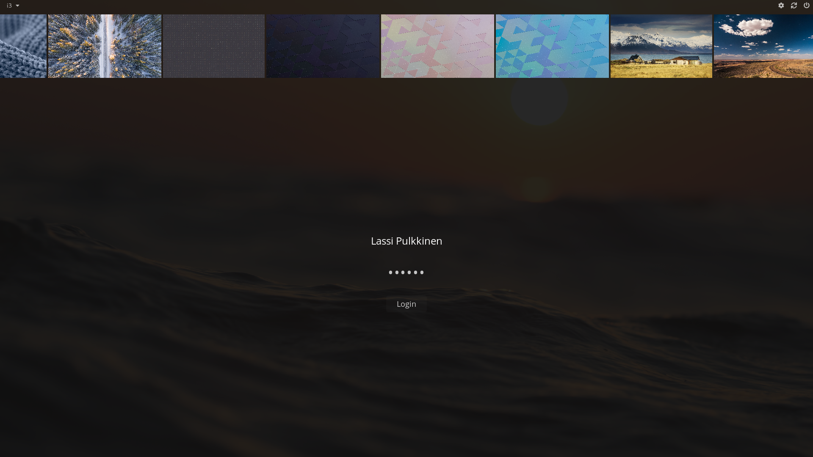
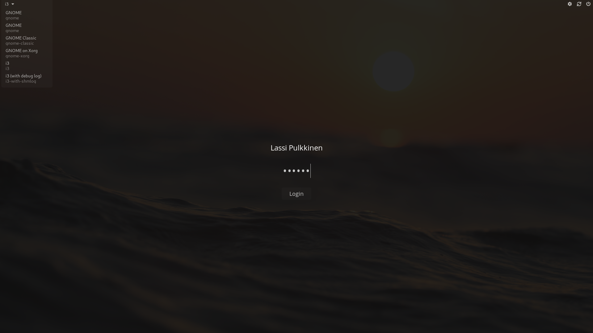

# lightdm-webkit2-theme
My LightDM Webkit2 greeter theme.

Note that originally I wasn't planning to publish this, so code quality isn't the best.
(I've done some cleanup but there's still not a single comment)

## Screenshots
##### (wallpapers from gnome-backgrounds)

